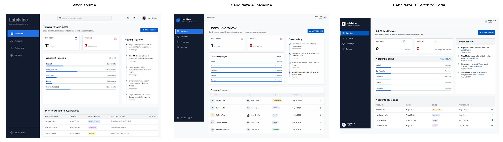
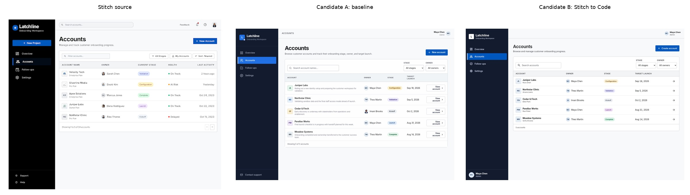
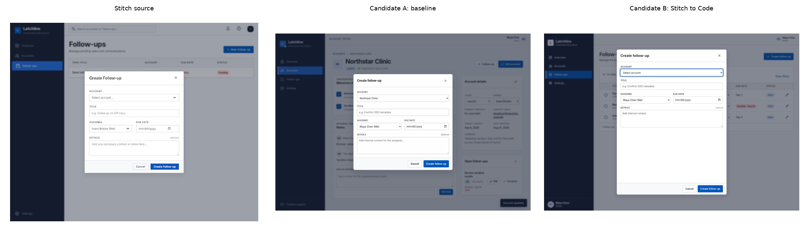

# First test: Latchline

This is a short summary of the first A/B test I ran while building Stitch to Code.

A fresh seven-screen Stitch project was implemented twice with Codex using `xhigh` reasoning:

- **Baseline:** normal Codex run.
- **Stitch to Code:** same frozen fixture and implementation prompt, with the skill installed.

A separate blinded evaluation scored 28 predefined observations.

| Category | Baseline | Stitch to Code |
| --- | ---: | ---: |
| Visual fidelity | 5/12 | 8/12 |
| Cross-screen consistency | 11/12 | 11/12 |
| Product truth | 19/20 | 20/20 |
| Responsive | 3/4 | 3/4 |
| Accessibility | 4/8 | 7/8 |
| **Total** | **42/56 (75.0%)** | **49/56 (87.5%)** |

The most useful result was not the headline score. It was seeing *where* the skill changed the implementation:

- the baseline declared Inter but did not actually load the required font files;
- it replaced Stitch's Material Symbols with its own SVG icons;
- the skill-assisted version loaded the expected font weights and used the intended icon family;
- accessibility behavior was better in the skill-assisted run;
- both runs were already strong at reconciling the predefined cross-screen inconsistencies;
- the skill-assisted run still made mistakes: its desktop modal was too tall and its full sidebar appeared too early.

The original score did not have a separate functionality category. A follow-up review found that both implementations covered the main required actions, but the baseline also introduced unsupported interactions (including email/support behavior and member reactivation) and had compact drawer keyboard/focus problems.

This was **one fixture and one run per condition**. It is useful as a case study, not as a claim about average performance across models or projects.

The current skill includes a few fixes prompted by this test, so the `49/56` score should be understood as belonging to the earlier treatment version rather than as a fresh score for the current files.

## Visual examples

### Overview

### Accounts

### Create follow-up modal

